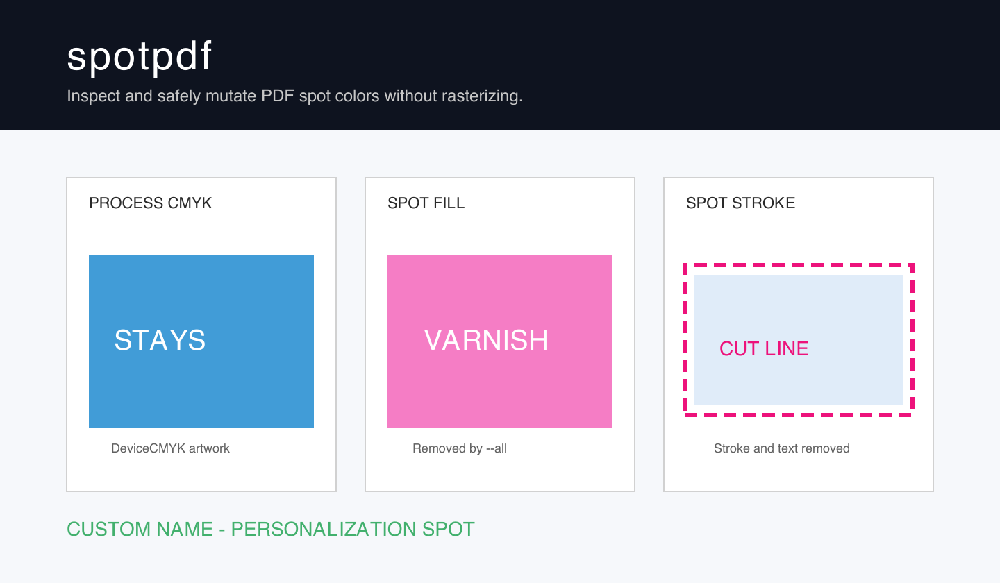
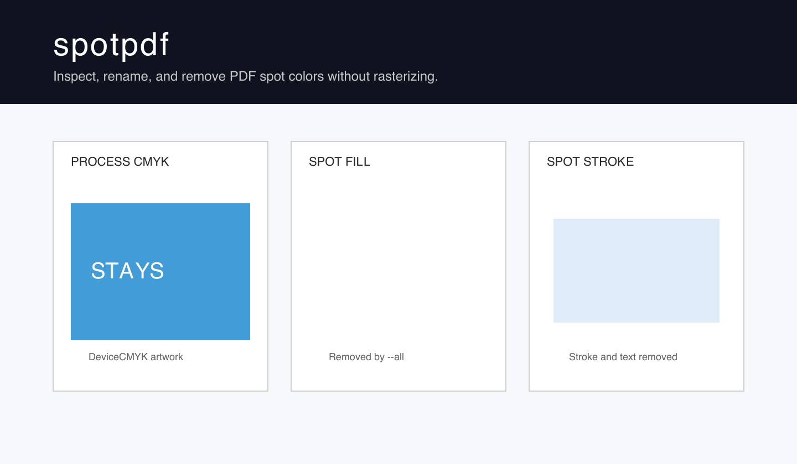

# spotpdf

[](https://github.com/Hyperrick/spotpdf/actions/workflows/ci.yml)

[](LICENSE)

`spotpdf` is a small, fail-closed command-line tool for finding PDF spot colors,
renaming spot plates, and removing supported vector or text paint that uses a
named `/Separation` color. Pages stay vector-based; the tool does not rasterize
them.

> [!IMPORTANT]
> This is a focused beta, not a general PDF preflight engine. Unsupported spot
> uses stop the whole operation without publishing a partial output.

## Before and after

These screenshots use a fully synthetic PDF generated by
[`examples/create_demo_pdf.py`](examples/create_demo_pdf.py). No customer or
production files are included in this repository.

<table>
  <thead>
    <tr>
      <th>Before: process artwork plus three spots</th>
      <th>After: <code>remove --all</code></th>
    </tr>
  </thead>
  <tbody>
    <tr>
      <td><a href="docs/images/demo-before.png"></a></td>
      <td><a href="docs/images/demo-after.png"></a></td>
    </tr>
  </tbody>
</table>

## Install

Python 3.11 or newer is required. Install the latest stable release as an
isolated command with [`uv`](https://docs.astral.sh/uv/):

```bash
uv tool install git+https://github.com/Hyperrick/spotpdf.git@v0.2.1
spotpdf --version
```

Or use `pipx`:

```bash
pipx install git+https://github.com/Hyperrick/spotpdf.git@v0.2.1
```

Stable `v0.2.1` contains `list`, `check`, and `remove`. The `rename` command
documented below is currently unreleased; install the current `main` branch to
try it before the next tagged release:

```bash
uv tool install --force git+https://github.com/Hyperrick/spotpdf.git@main
```

For development, clone the repository and use the locked environment:

```bash
git clone https://github.com/Hyperrick/spotpdf.git
cd spotpdf
uv sync --locked --dev
uv run spotpdf --help
```

## Quick start

List every reachable named colorant from `/Separation`, `/DeviceN`/NChannel,
and page `/SeparationInfo` declarations:

```bash
spotpdf list input.pdf
```

Example output from the synthetic demo:

```text
NAME             ROLE  KIND         PAGES  PAINT OPS  STATUS
CutContour       spot  Separation   1      2          painted
Personalization  spot  Separation   1      1          painted
Varnish          spot  Separation   1      1          painted
```

`ROLE` distinguishes `spot`, `process`, `all`, and `none`. For NChannel color
spaces, arbitrary names listed in `/Process /Components` are process channels,
not spots. With a CMYK NChannel process space, canonical `/Cyan`, `/Magenta`,
`/Yellow`, and `/Black` components also remain process channels even when they
are omitted from `/Process /Components`; this shortcut does not apply to RGB or
Lab process spaces.

Check one exact, case-sensitive name:

```bash
spotpdf check input.pdf --spot "Varnish"
```

`list` shows the complete named-colorant inventory, including process channels.
`check --spot` answers only for spot/removal candidates, so a process-only
NChannel component shown by `list` is reported as absent by `check`.

Rename one spot plate without changing its preview color or paint values:

```bash
spotpdf rename input.pdf --spot "Old Name" --to "New Name" -o output.pdf
```

Rename matching is exact and case-sensitive. The command changes every
supported semantic reference to the source plate as one transaction, including
role-aware DeviceN/NChannel spot participation, matching `/Colorants` and
`/MixingHints` entries, page `/SeparationInfo`, and normal printer-mark
appearances. It does not alter alternate color spaces, tint transforms, tint
operands, resource aliases, or content streams. This is plate aliasing, not a
conversion to process color. The source must have at least one reachable true
`/Separation` definition; DeviceN-only sources are rejected, while consistent
DeviceN/NChannel participation is renamed alongside that Separation. See
[PDF compatibility](docs/compatibility.md) for the deliberately unsupported
prepress structures and the relevant sections of the
[official Adobe-hosted ISO 32000-1:2008 copy](https://opensource.adobe.com/dc-acrobat-sdk-docs/standards/pdfstandards/pdf/PDF32000_2008.pdf).
The initial supported subset fails closed when the source occurs only as an
extra `/MixingHints` colorant for a DeviceN that neither declares it as a
component nor supplies a matching `/Colorants` Separation.

Remove supported paint for one name:

```bash
spotpdf remove input.pdf --spot "Varnish" -o output.pdf
```

Remove all supported named spots in one atomic rewrite:

```bash
spotpdf remove input.pdf --all -o output.pdf
```

`--all` preserves NChannel process components and, conservatively, the exact
canonical names `/Cyan`, `/Magenta`, `/Yellow`, and `/Black`, plus the reserved
names `/All` and `/None`. Matching is case-sensitive: a custom `/black` is
removed by `--all`. An exact request such as `--spot Black` still removes that
exact Separation.

Existing outputs are protected unless `--force` is supplied:

```bash
spotpdf remove input.pdf --all -o output.pdf --force
```

Even with `--force`, the old output is replaced only after the new PDF has been
written to a temporary file, reopened, parsed, and checked for remaining target
spots or stale rename references. The same atomic publication guarantee applies
to `rename`.

## Exit codes

| Code | Meaning |
| ---: | --- |
| `0` | The command completed; for `check`, the name is absent. |
| `1` | The PDF could not be processed safely. No output was published. |
| `2` | `check` found the requested name, or command-line arguments were invalid. |

Because “present” is an intentional `check` result, shell scripts should handle
exit code `2` explicitly.

## Supported scope

| PDF construct | `list` / `check` | `rename` | `remove` |
| --- | :---: | :---: | :---: |
| Named `/Separation` declarations | Yes | Yes | Yes, for the supported paint below |
| Vector fills, strokes, and combined path paint | Yes | Unchanged | Yes |
| Text fill and stroke paint | Yes | Unchanged | Yes, when positioning remains safe |
| Nested Form XObjects | Yes | Definitions only | Yes, with context and nesting safeguards |
| `/DeviceN` and NChannel declarations | Role-aware | Consistent spot components alongside a true Separation | No; selected spot components fail closed |
| `/Colorants` and `/MixingHints` dependencies | Yes | Yes, when structurally consistent | No; selected dependencies fail closed |
| Page `/SeparationInfo` | Yes | Yes, when structurally consistent | No; selected pre-separated colorants fail closed |
| PrinterMark normal appearances (`/AP /N`) | Yes | Yes, when structurally consistent | No |
| TrapNet `/SeparationColorNames` | Exact dependency inventory | No; target occurrence fails closed | No |
| Type 5 halftones, OPI, PrinterMark `/AP /R` or `/AP /D` | No dedicated hazard scan | No; target occurrence fails closed | No |
| Images, inline images, patterns, and shadings | Inventory only | Definitions only | No |
| Type 3 fonts and soft masks | Inventory only | Definitions only | No |
| Signed PDFs | Read-only inspection | No; rewriting invalidates signatures | No; rewriting invalidates signatures |
| Encrypted or modification-restricted PDFs | Limited by parser | No | No |
| Parser-detectable syntax errors or warnings | Limited by parser | No | No |

Removal also stops for clipping text, mixed text that would require font
metrics, shared Forms that need conflicting caller state, unresolved resources,
cyclic Forms, and Form nesting beyond the documented safety limit. See the
[compatibility notes](docs/compatibility.md) for exact behavior.

If a requested removal spot is absent, the input is copied byte-for-byte to the
new output path. A missing rename source is an error and publishes no output.
The tool never edits an input file in place.

## Reproduce the demo

Generate both PDFs entirely from code and run the same operation shown above:

```bash
mkdir -p tmp/pdfs/demo
uv run python examples/create_demo_pdf.py tmp/pdfs/demo/input.pdf
uv run spotpdf list tmp/pdfs/demo/input.pdf
uv run spotpdf remove tmp/pdfs/demo/input.pdf --all \
  -o tmp/pdfs/demo/output.pdf
uv run spotpdf list tmp/pdfs/demo/output.pdf
```

The final command should print `No reachable named colorants found.` To render PNGs
like the README images, install Poppler and use `pdftoppm`:

```bash
mkdir -p tmp/images
pdftoppm -png -r 144 -singlefile \
  tmp/pdfs/demo/input.pdf tmp/images/before
pdftoppm -png -r 144 -singlefile \
  tmp/pdfs/demo/output.pdf tmp/images/after
```

## How it stays safe

1. Open without parser recovery and reject syntax warnings.
2. Inventory reachable color declarations and exact-name dependencies.
3. Build a complete rename plan or perform a complete removal dry run before
   changing the in-memory document.
4. Apply all planned references or selected paint changes as one operation.
5. Save beside the destination, reopen strictly, and verify the result.
6. Atomically replace the destination only after every check succeeds.

This intentionally favors a clear refusal over a PDF that merely looks correct
in one viewer. See [architecture](docs/architecture.md) for module boundaries and
the mutation pipeline.

## Development

```bash
uv sync --locked --dev
uv run ruff check .
uv run ruff format --check .
uv run python -m unittest discover -s tests -v
uv build
uv run python scripts/check_distribution.py dist
```

All PDF test fixtures are generated at runtime. Do not add confidential,
customer, or production PDFs. Contribution and fixture rules are in
[CONTRIBUTING.md](CONTRIBUTING.md).

## Roadmap

The public beta intentionally keeps plate aliasing, preview changes, and
process conversion as separate operations. Planned follow-up work includes:

- setting a spot's alternate CMYK preview without converting the plate;
- converting a strictly supported Separation subset to explicit DeviceCMYK;
- single-pass inventory for documents containing many spot colors;
- configurable processing budgets for hostile or multi-tenant automation.

Changing an alternate color and converting to process CMYK have different print
semantics from `rename` and will not be hidden behind one ambiguous command.

## Project policy

- [Changelog](CHANGELOG.md)
- [Contributing](CONTRIBUTING.md)
- [Security policy](SECURITY.md)
- [MIT License](LICENSE)
